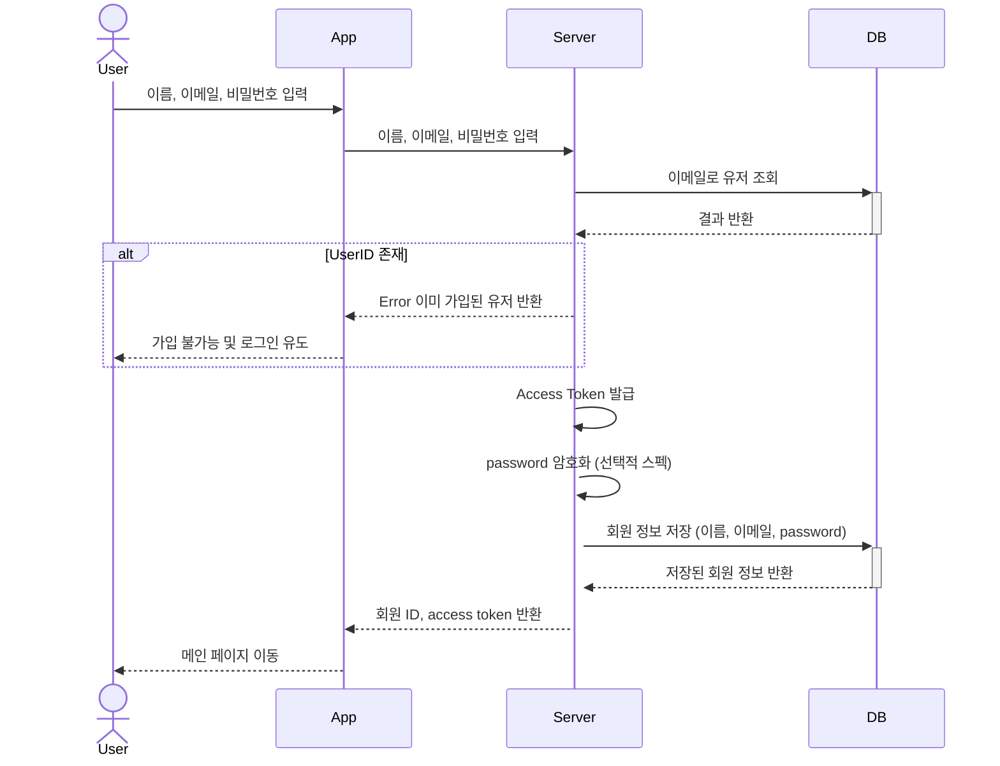
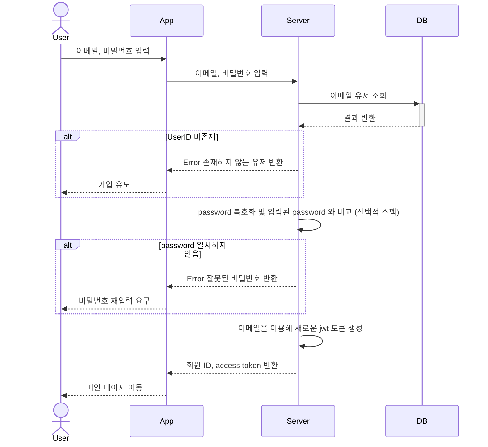
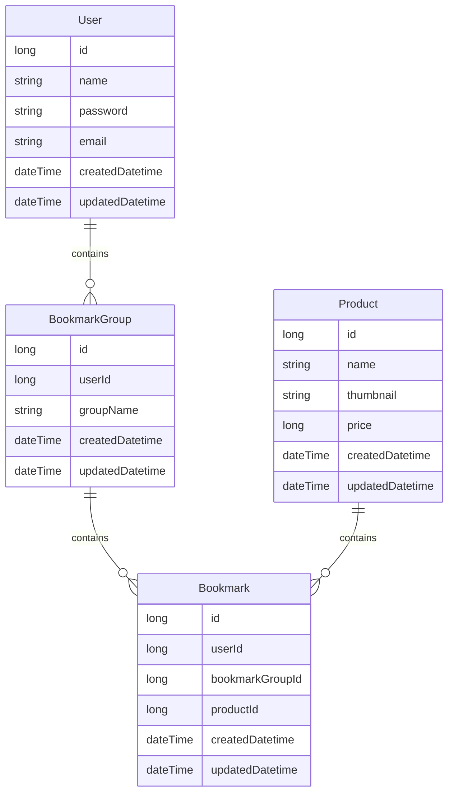

# bookmarkManagement
상품 찜 등록 관리

# 실행방법

- 도커 이미지 다운
```shell
$ docker pull hyeyeoncha/bookmark_backend_server:3.0
$ docker pull hyeyeoncha/bookmark_db:1.0
```

- mysql 접속 방법
```shell
$ docker exec -it bookmarkDB bash
$ mysql -u root -p
<asdf1234>
```

- 컨테이너 실행 (프로젝트 루트에서 실행)
```shell
$ docker compose up -d
```


각 API 예시 Curl
```shell

<test jwt>

# 유저 정보 가져오기
curl -X 'GET' \
  'http://localhost:8080/user/v1/1' \
  -H 'Authorization: Bearer <test jwt>' \
  -H 'accept: */*'


# 내 찜서랍 추가하기
curl -X 'POST' \
  'http://localhost:8080/product/bookmark/v1/groups' \
  -H 'Authorization: Bearer <test jwt>' \
  -H 'accept: */*' \
  -H 'Content-Type: application/json' \
  -d '{
  "groupName": "string"
}'


# 내 찜서랍 삭제하기
curl -X 'DELETE' \
  'http://localhost:8080/product/bookmark/v1/groups/1' \
   -H 'Authorization: Bearer <test jwt>' \
  -H 'accept: */*'


# 내 찜서랍 리스트 가져오기
curl -X 'GET' \
  'http://localhost:8080/product/bookmark/v1/groups?page=1&pageSize=10' \
  -H 'Authorization: Bearer <test jwt>' \
  -H 'accept: */*'  \
  -d '{
  “page”: 1,
  “page”Size: 15
}'


# 내 찜서랍의 찜 추가하기
curl -X 'POST' \
  'http://localhost:8080/product/bookmark/v1/groups/1/bookmarks' \
  -H 'Authorization: Bearer <test jwt>' \
  -H 'accept: */*' \
  -H 'Content-Type: application/json' \
  -d '{
  "productId": 1
}'


# 내 찜 서랍의 찜 삭제하기
curl -X 'DELETE' \
  'http://localhost:8080/product/bookmark/v1/groups/1/bookmarks/2' \
  -H 'Authorization: Bearer <test jwt>' \
  -H 'accept: */*'


# 내 찜 서랍의 찜 목록 가져오기
curl -X 'GET' \
  'http://localhost:8080/product/bookmark/v1/groups/1/bookmarks?page=1&pageSize=10' \
  -H 'Authorization: Bearer <test jwt>' \
  -H 'accept: */*'

```

--- 
# 회원가입 관련 Sequence Diagram


# 로그인 관련 Sequence Diagram


# Entity 관계도

